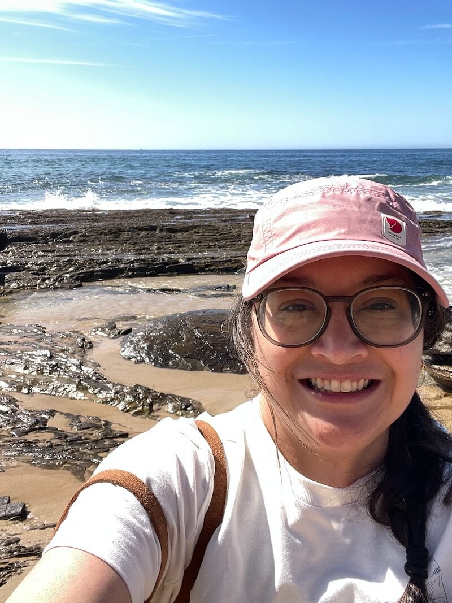

Hello there! I'm Cassi, an illustrator, fiber-artist, and all around too-many-hobbiest living in Bellingham, WA.

I moved back to my college mountain town in 2021, and I enjoy getting outdoors which informs a lot of the work I do. I love working with nature subjects, and playing around in watercolor, ink, and digital painting. My work in both fiber and illustration constantly balances my love of both fun and bright colors, and earthy neutrals.

Outside of painting I work as a [web developer](https://cassigs.com), enjoy making sweaters, and biking.
