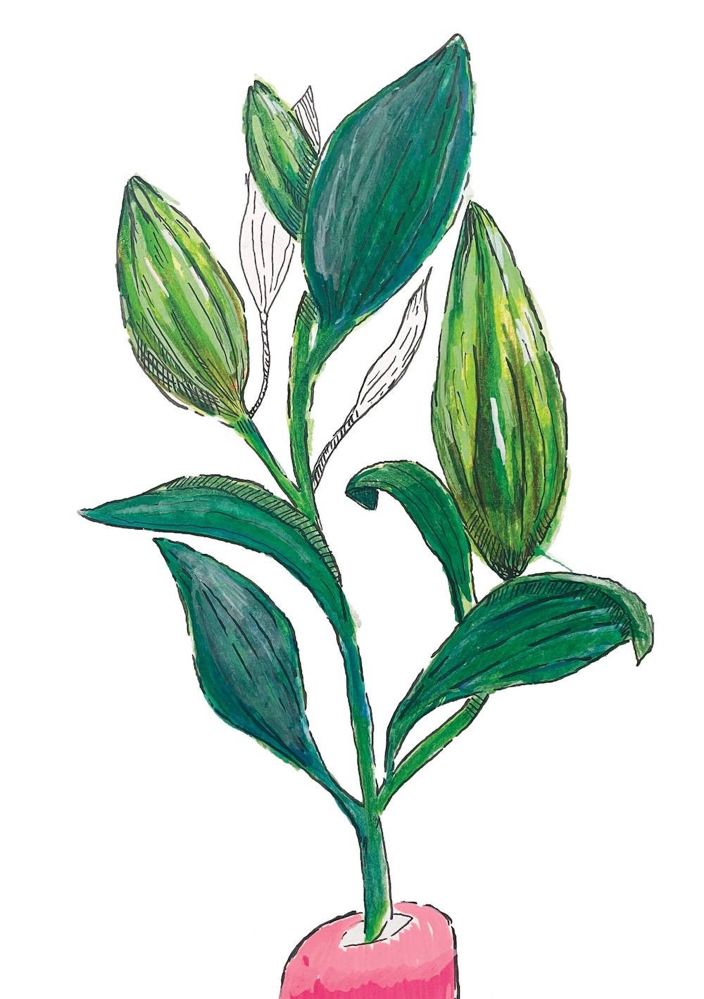
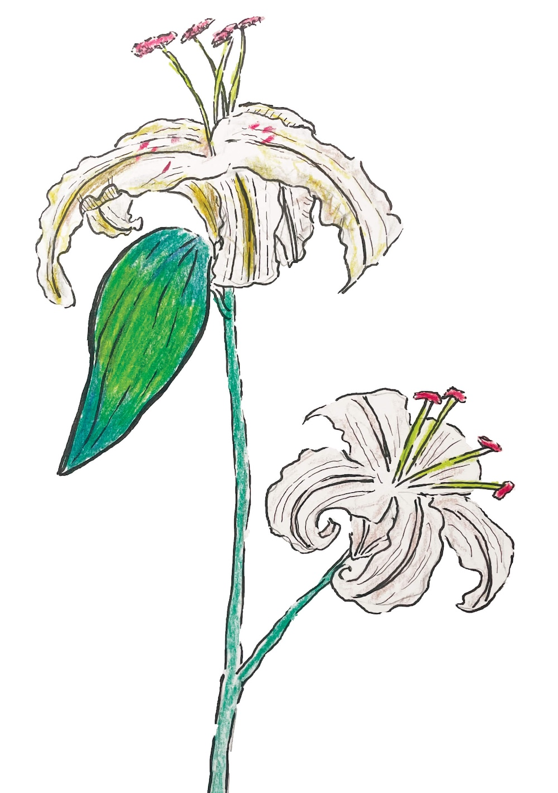
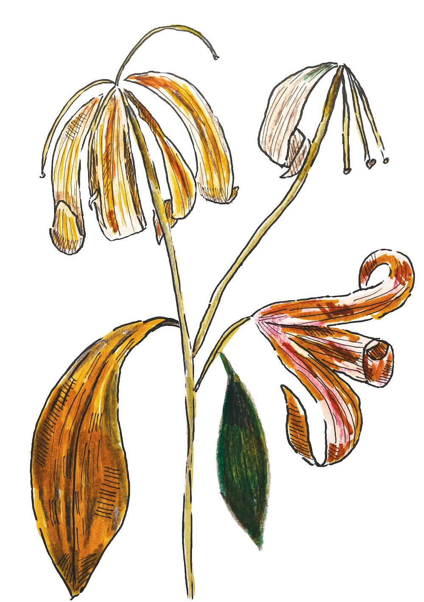
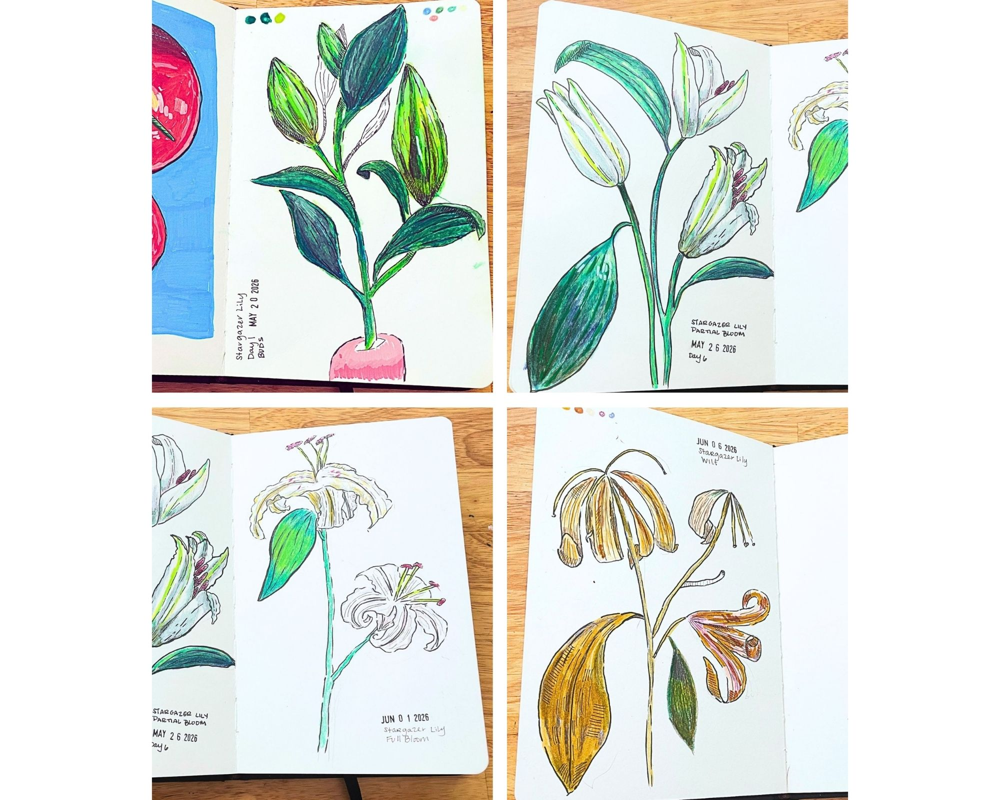

## Following a Lifecycle

I've been using a lot of online references lately for my art, with the exception of my houseplants. So when my course on Domestika suggested to get a flower and study it from bloom to wilt, I was surprised the thought never occured to me. That said - I also don't buy a lot of flower shop flowers.

This was a surprisingly challenging study. I choose a Stargazer Lily because I love how dramatic they look (worth the premium I paid at Trader Joes). I also find that while it's a mostly white flower, it proves particularly challenging to get the white and the shadows just right.

I tried a few different mediums on this - blending watercolor, trying tone with just colored pencils, adding a little acrylic. My only personal note is I feel like I was a little heavy handed with the wilt colors - but a lesson for next time.

I sadly missed the spectacularly full bloom stage as I was out of town for a couple of days right when it it. Of course - what are you gonna do. That said, this was a great challenge and I'll definitly give it another go at some point.

## Sketchook

