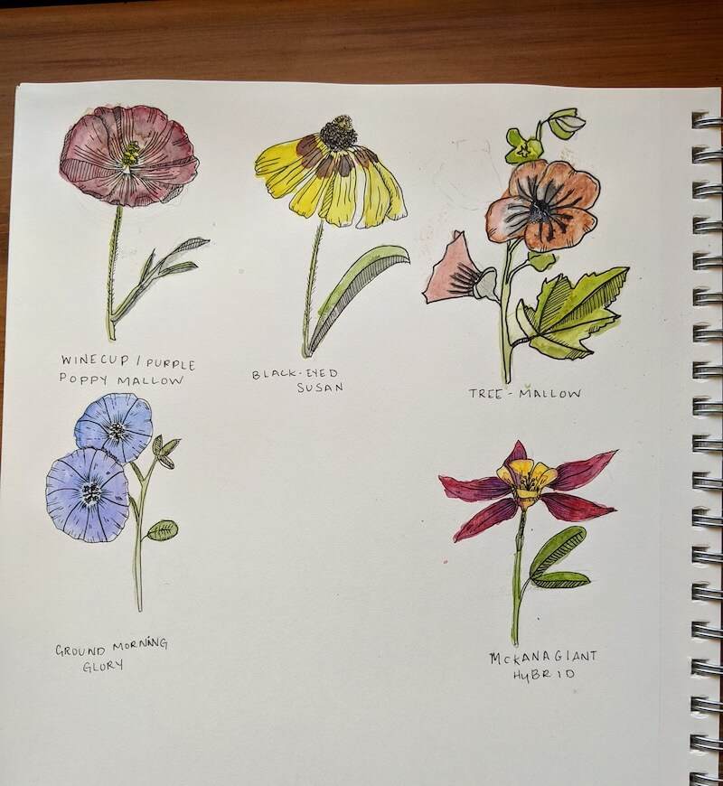
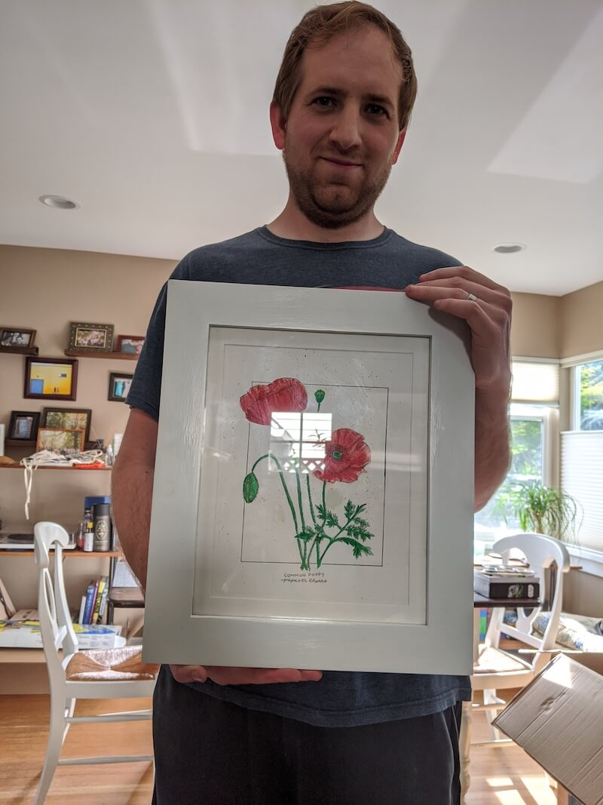
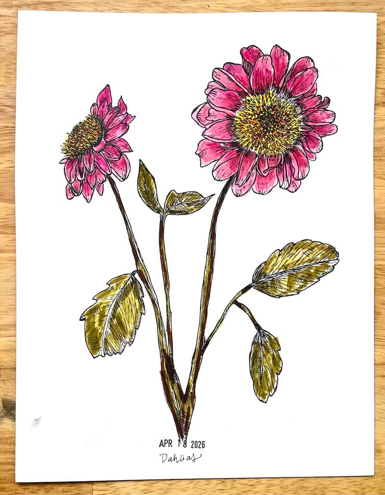
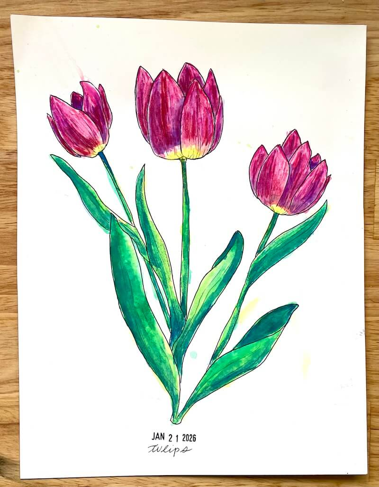

## Begin Again

Recently, I've been making an effort to take my art more seriously. I was laid off from my web development job in November, and the time off and job search have given me a lot of time to think about how I want to be spending my time in this world. I have a lot of hobbies and I've explored a lot of them on and off over time, but the one I've always come back to is art and illustration.

## Botanicals, Part 1

The last time I felt this pull was 2020. I was lucky enough to be able to find my way back to art and some dormant hobbies during that time, and drawing was one I wanted to pick back up again. To give myself a starting point I decided to try just drawing daily flowers.

I drew a botanical a day, for a long time. For the first time since I was younger though, I saw the power of just consistently showing up. I saw my work improving. It was exciting!

I even got a couple of commissions from some friends. Nothing big, but it was nice to connect with my friends through art during that isolating time. (And I had a handy husband that did the frames.)

## Burnout

After a while, due to pandemic burnout and a host of other reasons, I started to get burnt out on the botanicals too. I had also rediscovered crocheting, another past love of mine, learned how to knit — and fell into a knitting and crocheting rabbit hole, and once again drawing took a back seat.

## There And Back Again

And now I find myself in another moment of pause. Another declaration that nothing in life is guaranteed. And this time I'm exploring once again what it would mean for art to be back in my life. I think I've never taken art seriously before because I never knew what it meant to take it seriously. I think in the past I've thought I could only do that if I were planning to make it a job, to legitimize it in some way. But now I'm realizing that taking it seriously can be something as simple as an energy shift. A change of focus. Just leaning towards a creative practice a little more.

I want to make art first and then see where it takes me. So here I am again, 6 years later re-exploring botanicals, along with other subjects, mediums, what-have-you. I want to begin once again, shift my focus, and maybe see where that takes me.

