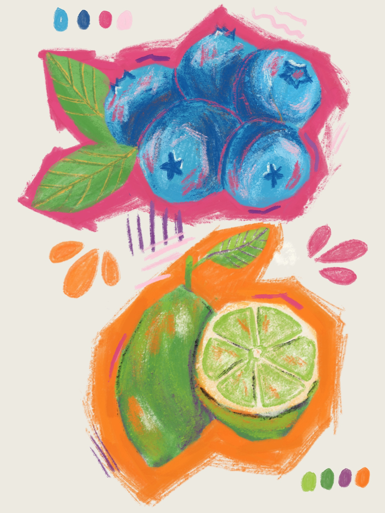

## Working Digitally

When I work, I often times waffle back and forth between analog tools and digital tools. While my art practice is a chance for me to step away from the screen for a bit, I do sometimes like working digitally. One, it's a good skill to have, especially if I want to start engaging in client work (which I have goals to do). Two, sometimes it's nice to dive into a sketch without all the "overhead" of analog tools. Also, I'd be lying if I said that double tap to undo wasn't a nice feature.

## The infinite option of choice

Of course, the downfall to working digitally is, of course, there is an infinite world of possibility. So many types of brushes, so many color options. I've seen other artists talk about the constraint of a limited pallet, which is something I've started incorporating - finding a pallet to start with and working specifically off of that (sometimes just googling for a couple of colors I want to start with + "pallet" and just finding one that I like if I really just want to work quickly but within constraint).

But color is one thing. There is also the constraint of which brush do I want to use, what kind of painting or art do I want to make? And even if I find something I want to make, sometimes I feel like I'm not using a brush to its full potential.

Now some of this is a matter of letting go and not worrying so much about using something "correctly" and just experimenting until I find something that I like. This is easier said than done but something I'm definitely working on.

But sometimes, it's nice having some guardrails. Which is why I got really excited when I found Gia Graham's brush reviews and tutorial. Specifically this latest one on how [she used one of the latest gouache brushes in Procreate](https://www.youtube.com/watch?v=2Izty01KjRs).

She goes over a quick tutorial on how she used the brush and a guide on how she tries out different brushes. It's a great guide and will definitely help me narrow things down in the future.

## The Final Piece

I've been very drawn to fruit lately and I'm working on a piece that involves blueberry and lime, so I decided to give it a go with that. I've been very drawn to super bright colors lately and in particular when artist incorporate complementary colors in as pops of color. Excited to use this method to try out other brushes!
