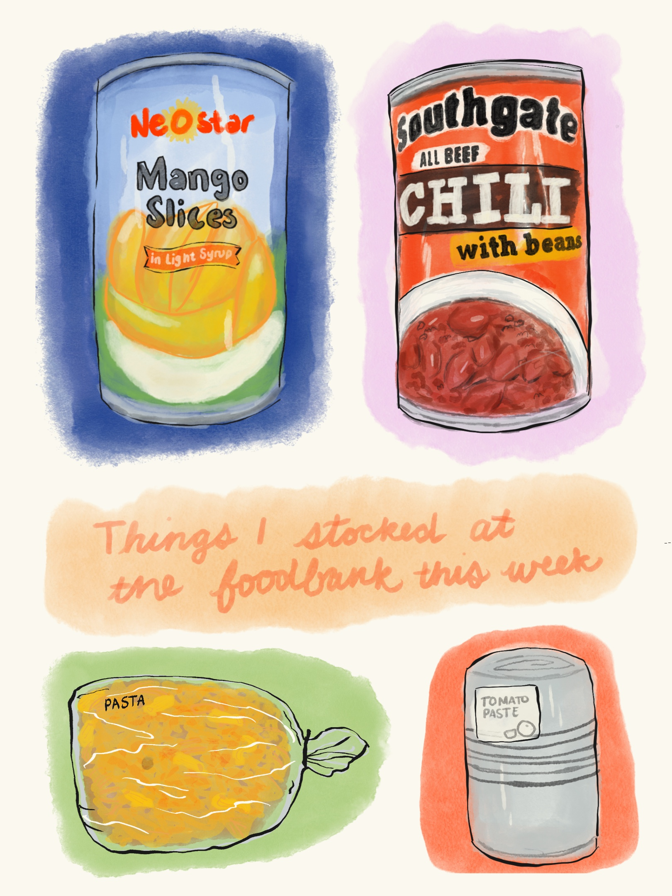
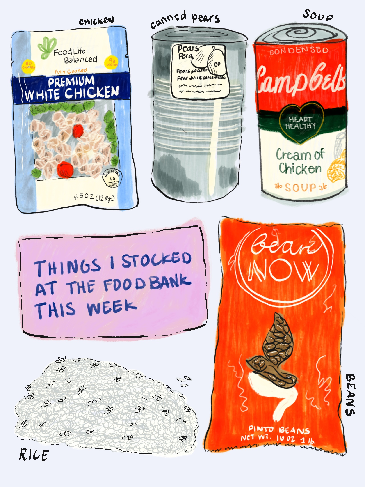

## It began with a new volunteer gig

Thanks to an unfortunate layoff last year, I've found myself with a lot more time on my hands. As a way to keep those hands busy and maybe do a little good in my community, I looked into volunteering at my local food bank.

I had actually looked into this when I first moved to Bellingham, as food insecurity is an issue near and dear to my heart. But because their hours are during the day, I couldn't swing it with a full-time job. This break provided that opportunity.

After a stint filling in for folks who called out, I snagged a weekly shift on Mondays. My food bank offers a grocery service on Mondays, Wednesdays, and Fridays — a chance for community members to come in and get grocery items for the week. Typically there are staple items along with whole foods such as vegetables, fruits, and canned and dried goods.

My job every week is to come in and see what items we're putting out for the day. Typically it's based on donations, what's available in the warehouse, and whatever schedule the food bank coordinators have worked out for the week. I get a list of items and their locations on the floor, and I begin my daily treasure hunt.

## The treasure hunt

I really like this part of the day. All the dried goods are stacked on pallets in the middle of the back room floor. I find them, figure out where they go on the floor, and spend the rest of the morning making sure everything stays stocked. Typically we've got staples like rice and dried beans, and often some canned goods.

Some days are really exciting — we get miscellaneous items through general donations, and those are fun because they go fast. It's really just a race against myself.

The biggest thing I learned about our food bank is that they buy their own food. Donations go towards purchasing food to help ensure that each week the grocery service has good quality staple items, in addition to the miscellaneous donations. So if you're feeling generous and want to support your local food bank — a monetary donation can go a long way, and in some ways further than a food donation.

## Grocery Flatlays

Inspired by the treasure-hunt feel of this weekly gig, I wanted to try some grocery flatlays. These were done in Procreate, as I wanted to experiment with a few of the different digital brushes and tools available.

There's something meditative about drawing the same kinds of objects you've just spent the morning sorting and stacking. It gives me a chance to notice and honor these items that are hopfully nourisihing members of my community. All in all its been a really great expirience so if you have a foodbank in your area I'd encourage you to volunteer or donate!
