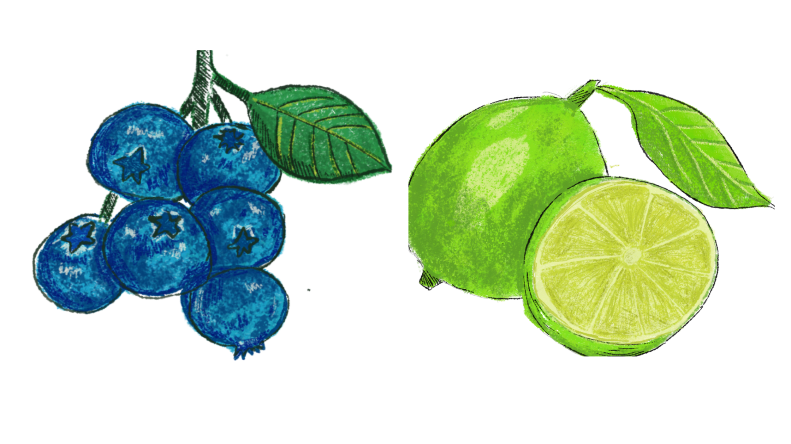
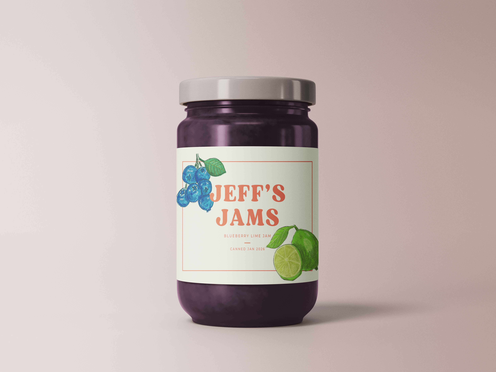
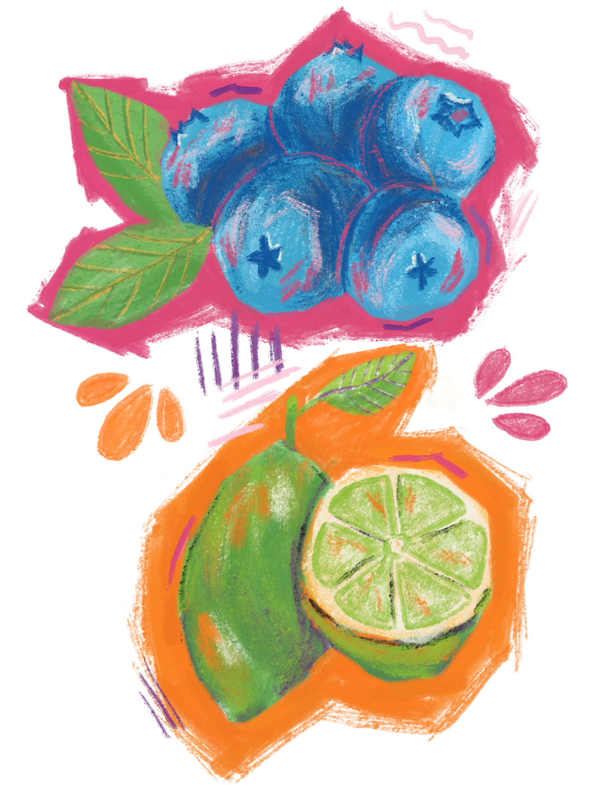
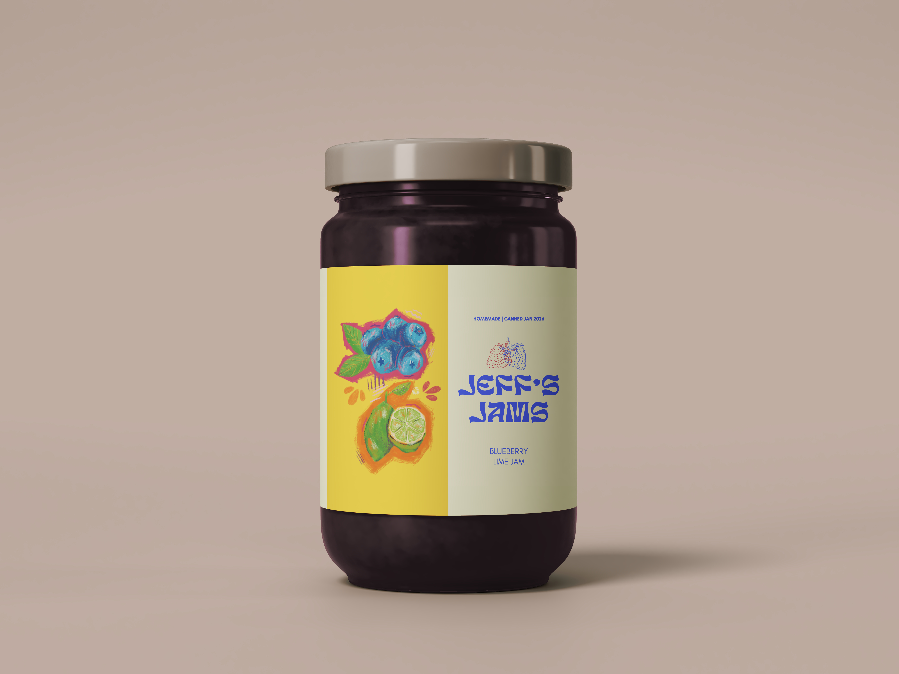

## Food illustration was not on my bingo card

I've been really drawn to food art recently. A few things that helped spark that, I think.

- **First**: I've been volunteering with my local food bank, and I've had food on the brain a lot recently.
- **Second**: In researching illustration paths, it came up as a niche, and it's a niche I feel like I could really get behind because:
- **Third**: I love food. I love cooking, I love baking, I love cookbooks. My best friend and I spent our teen years hanging out eating pizza and watching the Food Network. Enough said. (Which, if I thought I could cut it in a commercial kitchen I would have considered it as a career path).

All that to say, I've been really drawn to making food art right now.

## Finding inspiration in a silly summer tradition

With that in mind, I've been looking for ways to up my food illustration portfolio. Apart from drawing more food — which I am also enjoying and doing — I've been trying to find new ways to apply it. Packaging was one idea that came to mind, but what to make?

That's when a yearly summer tradition came to mind.

Every year, we host our nieces and nephew for a couple of days. We like to take them around and find them fun summer activities — one of them being berry picking.

One year, after we picked our (or at least their) weight in blueberries, the kids decided they wanted to make jam with it. My husband was on it, and they found a recipe that sounded good — one that used a little lime zest in it as well (what can I say they have excellent taste). The kids called it Jeff's Jam as a result. They filmed a whole commercial for it. It was as adorable as it sounds.

## A label idea was born

Now talk about a perfect subject to play around with some labeling. So I got to work. My first pass at this is a style that I've been working with the longest — a more watercolor and ink style (although these were done digitally) and one I've seen a lot in the food illustration inspo.

The result felt very heritage, so I made a label that matched the vibe.

This was all well and good. However, the heritage brand approach didn't feel _quite_ right for a brand made up by kids. I've been feeling a pull recently towards very vibrant, opaque, graphic art (acrylic markers, gouache, etc.). So I got to work, and the result was the graphic I posted last week.

With this I took the more Saturday-morning-cartoon vibe and ran with it.

## Closing thoughts

I really enjoyed the process of trying to think about my illustrations in a larger graphic design context. I think it would also be fun to explore a fully hand-lettered and illustrated version of the label. So there may be more iterations of this delicious, but very fake brand, in the future. If you have a favorite of these two, be sure to let me know [over on Instagram](https://www.instagram.com/p/DYp1m8vgWJQ/?img_index=1).
