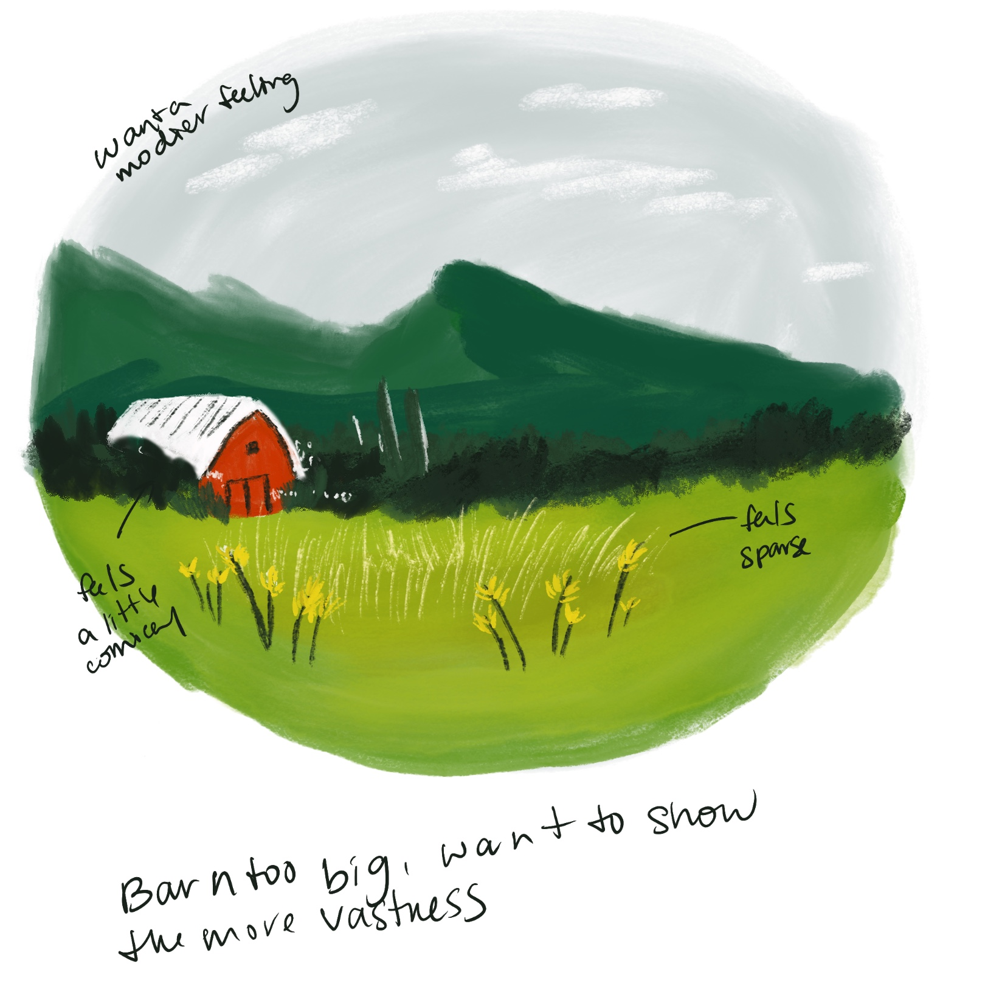
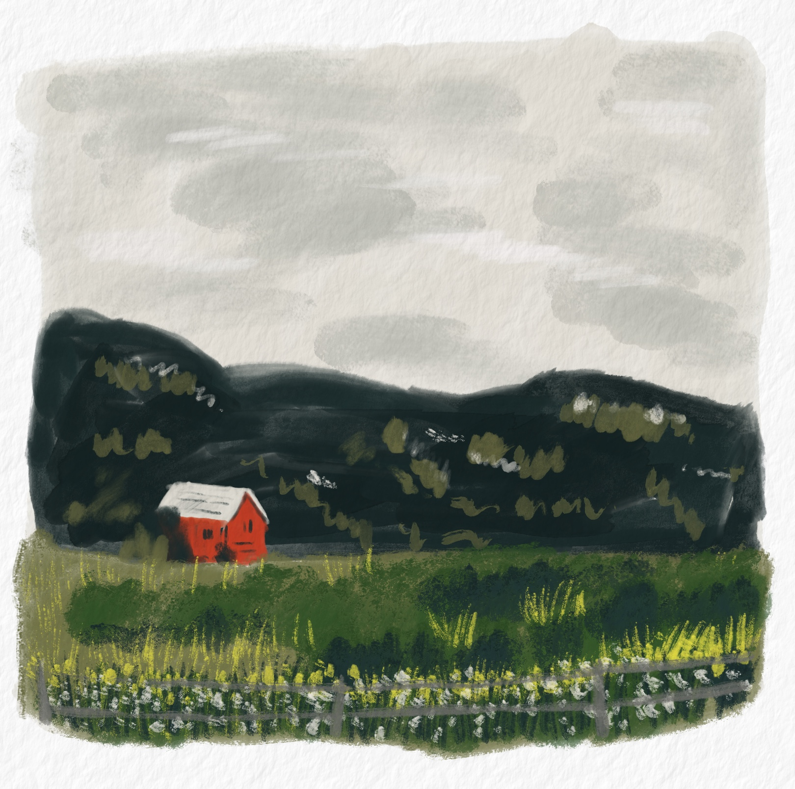
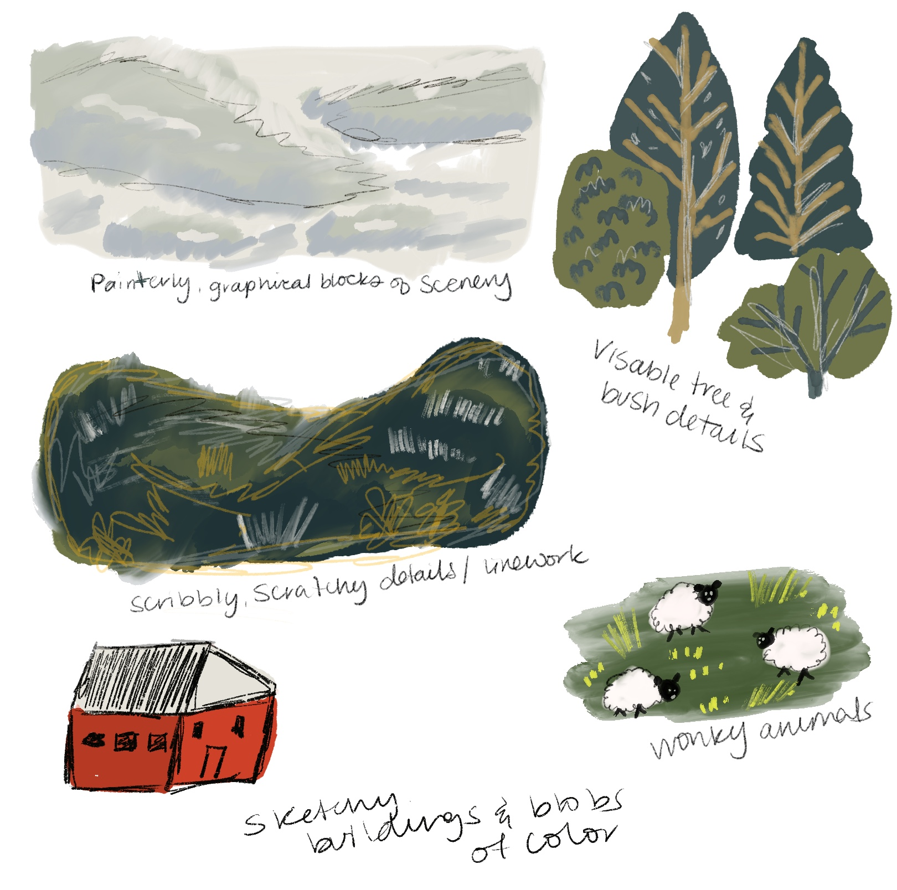
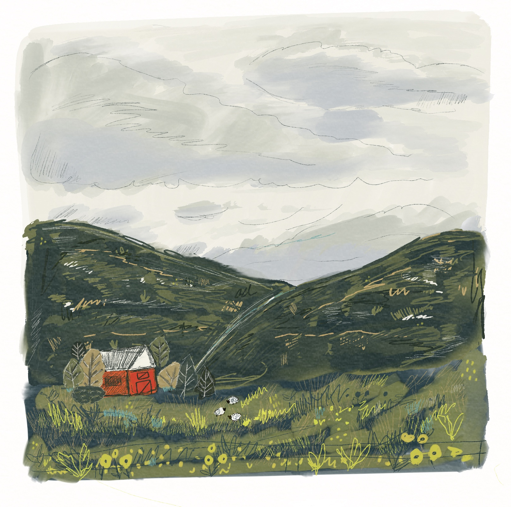

## Learning from Patreon Demos

Dylan Mierzwinski is an artist I've followed for a while. I love her art style as well as her style of teaching. I've taken a few of of her [Skillshare classes](https://www.skillshare.com/en/user/bydylanm?srsltid=AfmBOoo8bMGt9ZwsBp42uqbHY_wECHtILPSOd1m9E8so4-5fDc03aqbk) and her way of teaching just clicks well with me.

I've always loved illustration and art, but recently (thanks to a layoff and some classic mid-life-crisis life evaluation), I've been feeling the pull to take it more seriously. Not necisarrily in a quit-my-job (though I do have to get one still) kind of way. Just in a way where I shift my focus, my energy, my heart. To that end I ended up joining [Dylan M's Patreon](https://www.patreon.com/cw/Bydylanm). With demos, Q&A, feedback sessions and resources for artists, it seemed like a great fit.

I kicked things off with her demo for a storybook landscape. I’m someone who stresses over a lot of detail, so this offered a chance to play around working more loosely. I followed along with her demo (very Bob Ross style, which I loved) and came up with a nice little V1.

## V1: The intial video

I wanted to play around with what I wanted to change, so I jotted a few notes down and made a V2. Dylan offered to show her process for visual note taking, which I wanted to dig into - but for now I just took a few quick self-feedback notes. I wanted to go through the process of iterating on something. I also opted to work this up in Procreate - to get a better feel for the digital brushes.

## V2: Pass Number 1

Given that this is more iteration I've done for most of my work - I was quite happy with how this second version turned out. I felt like it captured a little more of the mood and style that I wanted to get. That said, I really wanted to dig into the iteration process, so I decided to go with a third version, this time incorporating some of that visual note taking technique that Dylan uses.

## The Visual Note Taking Process

I'm glad I did end up digging into more of the visual note taking session that she offered. It was a bit more involed than I originally thought - more a style explorationg than a self-feedback session. I was excited to take a crack at the third version with this new found visual language.

## V3: The Final Version

After that I took a third pass at my image, which is the final one here, and I am amazed how drastically a few new details can change an image. It was exciting! It was empowering! As someone who has been in sketchbook mode for a while, just make an item and go - I enjoyed this process of note taking and refinement, and thinking through a little critically through each next step. Looking forward to playing around in future demos!
