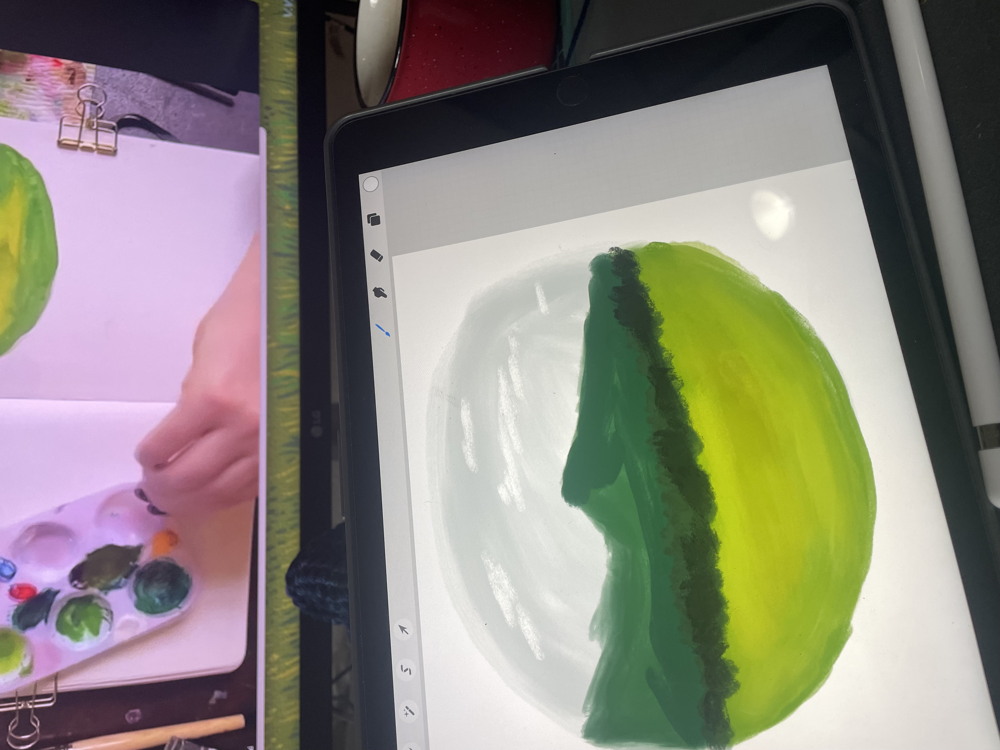

# My First Blog Post

Welcome to my first blog post. This is placeholder content written to give a sense of layout and typography as the site takes shape.

## Setting the Scene

Lorem ipsum dolor sit amet, consectetur adipiscing elit. Pellentesque habitant morbi tristique senectus et netus et malesuada fames ac turpis egestas. Vestibulum tortor quam, feugiat vitae, ultricies eget, tempor sit amet, ante.

Donec eu libero sit amet quam egestas semper. Aenean ultricies mi vitae est. Mauris placerat eleifend leo. Quisque sit amet est et sapien ullamcorper pharetra.

## More Thoughts

Vestibulum erat wisi, condimentum sed, commodo vitae, ornare sit amet, wisi. Aenean fermentum, elit eget tincidunt condimentum, eros ipsum rutrum orci, sagittis tempus lacus enim ac dui.

Donec non enim in turpis pulvinar facilisis. Ut felis. Praesent dapibus, neque id cursus faucibus, tortor neque egestas augue, eu vulputate magna eros eu erat.

## Wrapping Up

Aliquam erat volutpat. Nam dui mi, tincidunt quis, accumsan porttitor, facilisis luctus, metus. Phasellus ultrices nulla quis nibh. Quisque a lectus. Donec consectetuer ligula vulputate sem tristique cursus.
